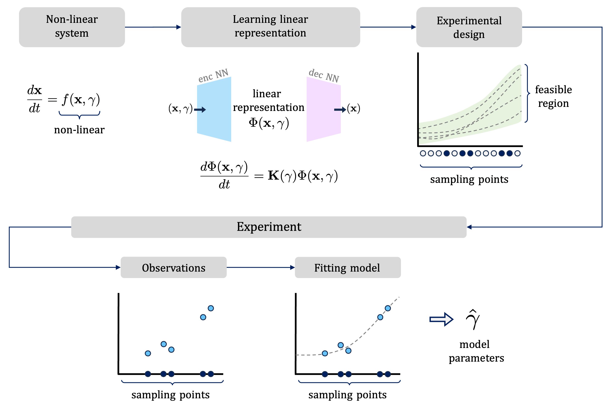

# LODED: Linearised ODE Designs

## Overview

LODED is a research project developed as part of a Master thesis, focusing on the Optimal Experimental Design (OED) for estimation of parameters of non-linear Ordinary Differential Equations (ODEs). The project leverages classical OED, operator theoretic approach to dynamical systems, and deep learning to create sampling schemes for estimating model parameters. 

## Key Concepts

- **Linear Experimental Design for linear ODEs**: Utilizes statistical techniques to optimize the allocation of experimental resources. The goal is to maximize the information gained about a system's parameters while minimizing experimental costs and efforts. Linear ODE can be expressed as a linear constraint on a linear model, allowing to use classical OED for sampling such systems.

- **Linear representation of Dynamical Systems**: An appropriate coordinate system can often describe a non-linear system by linear dynamics. Such representation of the system is called a linear representation. In this project we leverage deep learning for finding such coordinate systems.

- **Linearised ODE Designs (LODED)**: LODED leverages the above ideas for finding sampling schemes for non-linear dynamical systems. LODED learns a linear represenation of the non-linear dynamical system and subsequently uses linear experimental design to arrive at sampling schemes that allow for efficient estimation of system parameters.




## Installation

To install LODED, follow these steps:

```bash
# Clone the repository
git clone https://github.com/AntanasMurelis/LODED.git
cd LODED

# It's recommended to use a virtual environment
python -m venv venv
source venv/bin/activate  # Use `venv\Scripts\activate` on Windows

# Install the project
pip install .

# Alternatively, for development purposes, you might want to install the project in editable mode
pip install -e .
```


## Use

Here's how to get started:

### Setting Up Your Experiment

1. **Define Your System**: Start by defining the non-linear dynamical system you want to study. This involves specifying the differential equations that describe the system's behavior. The vector field should be added to ``` DynamicTraining.py ```.


2. **Representation Configuration**: Set up the configuration for your experiment. This may involve editing/creating a configuration file with details about the dynamical system, the range of parameters to explore, and the specifics of the deep learning model. This can be found in DeepKoopman module. The model then can be trained using ``` DynamicTraining.py ```.

3. **Experimental Design**: The learned model can then be used to obtained experimental designs using ```MakeDesigns.py```. This will require the trained model.
